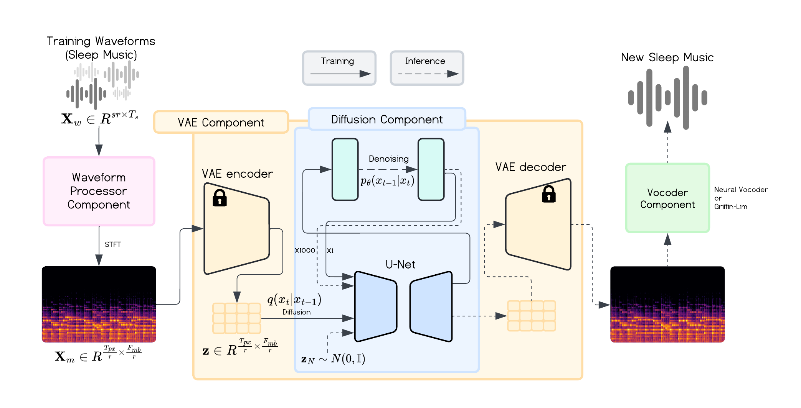

Timo Hromadka MPhil Project.

This repository builds on the repository by Robert Dargawel Smith (https://github.com/teticio/audio-diffusion).

My additions to the repository include:
- bug fixes
- architecture modifications
- conditional generation script, t5 model encoding
- experimentation + hpc integration
- result analysis
- creative task experimentation (inpainting, outpainting, music style transfer) with novel models/datasets

## Model Architecture



Across this github repo, there are numerous scripts to handle different parts of the audio processing pipeline, training, inference, and evaluation. We break down the main scripts with the main hyperparameters so that you can get started. To get a full list of the hyperparameters to choose from, you can view the individual scripts and their `args`. The scripts below will show default hyperparameters, but make sure they're matching for your use case.

### Environment and Repository Setup

#### Conda Environment Setup
To set up the audio diffusion conda environment, use:
```
conda env create -f audiodiff_env.yml
```

To set up the BigVGAN conda environment, use:
```
conda env create -f bigvgan_env.yml
```

To set up the FADTK environment, use:
```
conda env create -f fadtk_env.yml
```

#### Repository Setup
If training models to be used together with BigVGAN vocoders, we will need to install the BigVGAN repository as a sub-directory.

First, navigate to the main directory of this directory and then clone the repository:

```
git clone https://github.com/NVIDIA/BigVGAN.git
```

### Preparing Data

#### Download Sleep Dataset
Firstly, select which dataset to train the models on. We train for sleep music generation. To download the sleep music dataset, please find it on the HuggingFace link: https://huggingface.co/datasets/TimoH/spotify_sleep_dataset. We have created this HuggingFace dataset from the dataset collected by this research paper (https://www.researchgate.net/publication/352202690_The_music_that_people_use_to_sleep_universal_and_subgroup_characteristics).

In our paper, we filter our genres to only include the 'sleep' genre, you may wish to do the same.

Then, download the samples from the `SampleURL` field.

For evaluation, you will need an evaluation dataset, commonly either MusicCaps or FMA-Pop. Links here:
https://www.kaggle.com/datasets/googleai/musiccaps
https://github.com/mdeff/fma

#### Audio to Mel-Spectrograms
To create a dataset of mel-spectrograms (rather than waveform), conert them into an Arrow dataset using this script:

```
python scripts/audio_to_images.py \
--resolution 1024,256 \
--hop_length 256 \
--n_fft 1024 \
--mel_spec_method image \
--input_dir cache/spotify_sleep_dataset/audio/  \
--output_dir cache/spotify_sleep_dataset/mel_spectrograms/mel_spec_256_256 \
--sample_rate 22050 \
--num_channels 1 \
```

#### Train a VAE (Optional)
For latent experiments, we first need to train a vae. Use the `train_vae.py` script.

Make sure to match the parameters with that of the mel-spectrogram dataset (in terms of `hop_length`, `sample_rate`, `n_fft`, `resolution`)

If continuing a training, use the `--resume_from_checkpoint` argument.

```
python train_vae.py \
--mel_spec_method image \
--ldm_config_file config/ldm_autoencoder_kl.yaml \
--ldm_checkpoint_dir models/ldm-autoencoder-kl \
--hf_checkpoint_dir models/autoencoder-kl \
--hop_length 256 \
--sample_rate 22050 \
--n_fft 1024 \
--save_images_batches 1000 \
--save_every_n_batches 1000 \
--latent_dims 128,32 \
--resolution 2048,128 \
--model_size small
```

#### Train a U-net
To train a u-net model, specify the main parameters. Remember to be consistent with the data parameters to match the dataset and/or pretrained VAE (this includes `hop_length`, `sample_rate`, `n_fft`, `resolution`).

If continuing a training, use the `--from_pretrained` argument.

If training a latent diffusion experiment, specify the path of the VAE model using the `--vae` argument.

If using encoding (for conditional generation), use the `--encodings` argument.

```
python train_script.py \
--dataset_name data/spotify_sleep_dataset/ \
--mel_spec_method image \
--model_size small \
--output_dir models/ddpm-model-2048x128 \
--train_batch_size 16 \
--eval_batch_size 16 \
--num_epochs 100 \
--max_training_num_steps 100000 \
--learning_rate 0.0001 \
--lr_scheduler cosine \
--hop_length 256 \
--sample_rate 22050 \
--n_fft 1024 \
--num_train_steps 1000 \
--num_inference_steps 1000 \
--train_scheduler ddpm \
--test_scheduler ddpm 
```

#### Inference of a U-Net
To actually generate samples using a trained model, use the `inference_unet.py` script.

Select how many images you wish to generate (`--num_images`) and how many Griffin-Lim Iterations to use `--n_iter`. If using encodings for conditional generation, these must be calculated in advance using a text-encoder of your choice, and the pickle file to the dictionary of encodings provided in `--encodings`.

```
python inference_unet
--pretrained_model_path models/ddpm-model-2048x128 \
--mel_spec_method image \
--num_images 1024 \
--num_inference_steps 1000 \
--n_iter 32 \
--eval_batch_size 32 \
--scheduler ddpm
```

#### BigVGAN Tensors to Audio Conversion
If a model generates mel-spectrograms prepared for the BigVGAN vocoder, we need to convert the generated `.pt` files into audio before evaluation.

First, activate the `fadtk_env` conda environment
```
conda activate fadtk_env
```

Then, navigate to the BigVGAN sub-repository
```
cd bigvgan
```

Now, we can use the conversion script, which will create an audio subdirectory with the converted audio files.
```
python convert_bigvgan_pt_to_audio.py --directory models/ddpm-bigvgan-model-2048x128/tensors/
```

#### Evaluation of Generated Samples
Once the samples are generated, we can calculate FAD scores for them using the 'evaluation.py` script.

First, activate the fadtk_env conda environment
```
conda activate fadtk_env
```

```
python evaluation.py
--reference_paths path/to/fma_pop path/to/music_caps \
--generated_path  models/ddpm-model-2048x128/model_step_100000/ mples/audio/ \
--metric frechet_audio_distance \
--model_names clap-laion-audio clap-laio-music vggish
```

