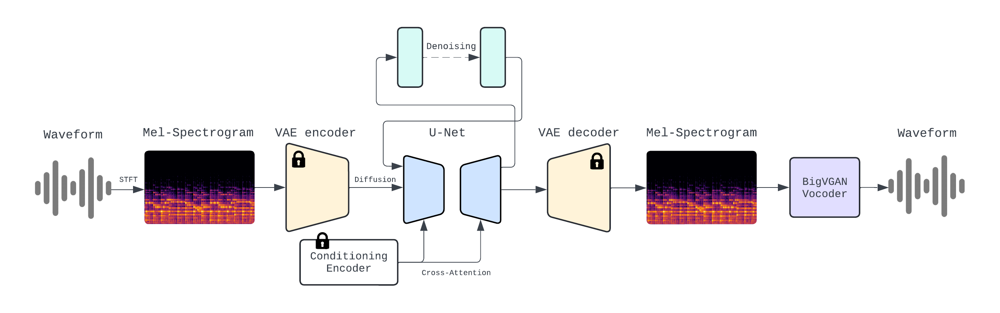

Timo Hromadka MPhil Project.

This repository builds on the repository by Robert Dargawel Smith (https://github.com/teticio/audio-diffusion).

My additions to the repository include:
- bug fixes
- architecture modifications
- conditional generation script, t5 model encoding
- experimentation + hpc integration
- result analysis
- creative task experimentation (inpainting, outpainting, music style transfer) with novel models/datasets

## Model Architecture

